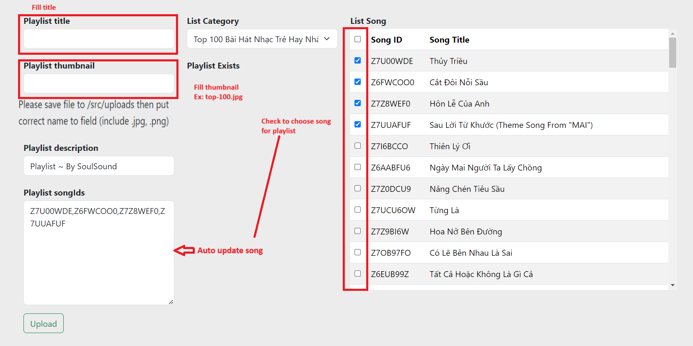

### CREATE PLAYLIST FOR SOULSOUND

1. Clone project & `npm i`
2. Create file `.env` and insert data (Thắng gửi)
3. Run project `npm run dev` & App will run on port `localhost:8001`
4. Access `localhost:8001\playlist`
5. Save image to `src/uploads` and set name clearly
6. Choose category
  

7. Fill field 
  - Bắt buộc tên ảnh khi nhập vào phải cùng tên với file ảnh đã lưu trong `src\uploads`
  - Title không được trùng ( hiện trong playlist exists)
  

8. Press `UPLOADS` and wait
  - Hãy đợi cho tới khi nhận được thông báo thành công | thất bại
  